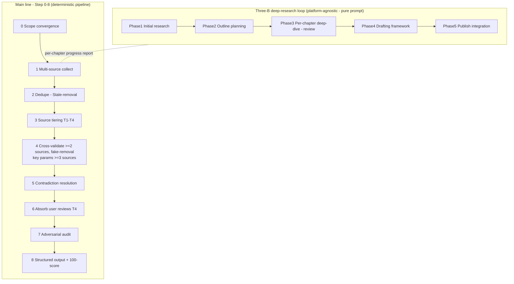
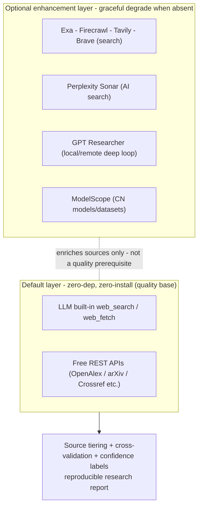

# Deep Market Research — Deep Market Research Skill

> 🌐 语言 / Language：**[🇨🇳 中文](README.md)** · [🇺🇸 English](README_EN.md)

> A cross-platform AI-agent research workflow: source tiering + ≥2-source cross-validation + dedupe / stale / fake / contradiction removal + real user-review absorption, producing stable, reproducible, confidence-labeled research reports.

[](LICENSE)
Follows the [Agent Skills open standard](https://agentskills.io/) (initiated by Anthropic; natively supported by 50+ platforms including Claude Code / OpenAI Codex / TRAE / Qoder / WorkBuddy).

---

## ✨ Features (v2.3.0)

> Core difference vs generic AI search / deep-research skills: **dmr is not a search wrapper — it is a reproducible, confidence-labeled research pipeline with adversarial final-draft auditing.**

### Version evolution (newest first)

- **v2.3.0 Platform-agnostic + deep-research loop (de-cluttered, generalization-first)**: ① zero-dependency, zero-install by default - no assumption of any platform MCP / agent-team protocol / proprietary backend; ② new **Three-B deep-research loop (platform-agnostic, pure-prompt orchestration)** absorbing the essence of multi-platform deep-research agent teams; ③ competitive-key-param cross-validation raised from >=2 to >=3 sources; ④ quality rules added - optional tools are not a quality prerequisite / no platform lock-in; ⑤ new `references/cross-platform-tools.md` guide for six platforms.
- **v2.2.10 Optional search backend appendix reinforcement**: AnySearch / Metaso registered as optional CN enhancements; key-free graceful degradation; main pipeline untouched.
- **v2.2.7 P1 integration + de-cluttering**: structured asset accumulation + optional deep backend + Step 1 intent routing + native CJK.
- **v2.2.6 Adversarial audit discipline**: corpus critic + 4 parallel critics + patch-never-regenerate + source tree + lint checklist.
- **v2.2.5 Search methodology sharpening**: information-density first, cross-source diversity weighting, three-axis hybrid ranking.
- **v2.2.4 Normative enhancements**: FAQ, end-to-end example, full changelog appendix. → [SKILL.md Section 8 / FAQ](SKILL.md)

### Unique advantages

- **Deterministic pipeline**: fixed Step 0–8, reproducible and comparable every run.
- **Source-tier confidence**: T1 official / T2 expert / T3 secondary / T4 social; every conclusion carries a confidence label.
- **≥2-source cross-validation**: facts are decomposed, conflicts are explicitly flagged, no forced consensus.
- **Adversarial final-draft audit**: an independent critic challenges the draft before delivery; local patches, never full regeneration.
- **Native Chinese/CJK support**: WeChat official accounts, Zhihu, Xiaohongshu, CNKI and other Chinese sources are never dropped or treated as junk.
- **Zero-install skill**: pure methodology calling the agent's built-in tools, no extra Python dependency.
- **Optional tools never block**: Exa / Firecrawl / Tavily / Perplexity / GPT Researcher / ModelScope enhance when present, gracefully degrade when absent.
- **Platform-agnostic**: no assumption of any MCP config / agent-team protocol / proprietary backend; works on WorkBuddy / Claude / Codex / Trae / qoder / Cursor; optional tools degrade gracefully when absent.

### Output capabilities

- **Three templates**: general research / industry track (McKinsey-style) / company competitive (SWOT + scenario simulation).
- **intel-brief style**: fact → impact → cause triad organization.
- **Academic modules**: arXiv / PubMed / OpenAlex / Semantic Scholar / CNKI, free 🆓 APIs preferred.
- **Analysis lenses**: Porter's Five Forces / PESTEL / BCG / 3C / TAM-SOM, triggered by intent, never piled on.
- **Incremental accumulation**: structured markdown note (YAML frontmatter), integrates with ima / Obsidian / local wiki.

---


### Tech stack & pipeline (visual)

**Research pipeline** - the Step 0-8 main line and the Three-B deep-research loop are orthogonal; quality is guaranteed by methodology, not by any single search API:



**Tech stack** - default layer is zero-dependency, zero-install; the optional enhancement layer degrades gracefully when absent and only enriches source material:



---

## 🌐 Supported platforms

This repo follows the [Agent Skills open standard](https://agentskills.io/). The platforms below support it natively and **will auto-discover and trigger the skill once installed**:

| Platform | Skills directory | Trigger |
|----------|------------------|---------|
| **Claude Code / Claude** | `~/.claude/skills/` | auto-discover + `/deep-market-research` |
| **OpenAI Codex** | `~/.codex/skills/` | auto-discover |
| **TRAE** | `~/.trae/skills/` | auto-discover |
| **Qoder** | `~/.qoder/skills/` | auto-discover |
| **WorkBuddy / CodeBuddy** | `~/.workbuddy/skills/` | auto-discover |
| Other agentskills-compatible platforms | the platform's `skills/` directory | auto-discover |

> See the full client list at [agentskills.io/clients](https://agentskills.io/clients).

---

## 📦 Installation

### Option 1: One-click install script (recommended)

After cloning, run the install script — it auto-detects installed agent platforms on this machine and copies the skill into the corresponding `skills/` directory:

```bash
# Unix / macOS / Git Bash
git clone https://github.com/Rain3Dmetrology/deep-market-research.git
cd deep-market-research
./install.sh

# Windows (PowerShell)
git clone https://github.com/Rain3Dmetrology/deep-market-research.git
cd deep-market-research
powershell -ExecutionPolicy Bypass -File install.ps1
```

The script detects and installs into **existing** directories among `~/.claude`, `~/.codex`, `~/.trae`, `~/.qoder`, `~/.workbuddy`; uninstalled ones are skipped automatically.

### Option 2: Manual installation

Copy the entire `deep-market-research/` folder into the target platform's skills directory:

```bash
git clone https://github.com/Rain3Dmetrology/deep-market-research.git
# Claude Code / Codex / Cursor / Windsurf / Gemini CLI, etc.
cp -r deep-market-research ~/.claude/skills/
# WorkBuddy
cp -r deep-market-research ~/.workbuddy/skills/
# TRAE
cp -r deep-market-research ~/.trae/skills/
# Qoder
cp -r deep-market-research ~/.qoder/skills/
```

After installation, **restart the agent** (or run the skill-refresh command) to load it.

---

## 🚀 Usage

Just tell the agent (auto-matched to `SKILL.md`'s `description` trigger):

- "Research the competitive landscape of industrial AI 3D vision metrology"
- "Competitive analysis: Hikrobot vs DEEPVISION vs Techman Robot"
- "Industry trend: investment opportunities in China's machine-vision supply chain"
- "Dig into Keyence China's background"

The agent executes the fixed SKILL.md flow: scope convergence → multi-source collection → dedupe/stale-removal → source tiering → cross-validation/fake-removal → contradiction resolution → user-review absorption → 100-point scoring → structured output.

---

## 📂 Directory structure

```
deep-market-research/
├── SKILL.md          # Core: metadata + complete workflow instructions (Step 0–8 + three templates + analysis lenses + quality rules)
├── README.md         # Chinese documentation (this repo's home page)
├── README_EN.md                  # English documentation
├── references/
│   └── cross-platform-tools.md   # Optional: six-platform enhancement-tool setup guide (absence does not affect main flow)
├── LICENSE                       # MIT
├── CONTRIBUTING.md               # Contribution guide
├── install.sh                    # Unix install script
├── install.ps1                   # Windows install script
└── .gitignore
```

> The skill's core is **self-contained**: all workflows, templates, and rules are embedded in `SKILL.md`; no extra scripts or config files are needed. `references/` is only an optional enhancement-tool guide; its absence does not affect the main flow.

---

## ⚙️ Optional data sources & enhancement skills (plug in as needed, graceful degradation)

The skill itself works using the agent's built-in web tools (WebSearch / WebFetch). If your agent has the following skills installed or the following MCPs connected, it automatically gains deeper coverage; **when absent, it always degrades gracefully and never interrupts the research**:

| Dimension | Data source / Skill | Purpose | Status |
|-----------|---------------------|---------|--------|
| **Search entry** | built-in WebSearch/WebFetch (preferred) + **Tavily** (direct API call with key; skill permanently removed in v2.2.1) + **AgentKey** (aggregated data API: search/news/social/stocks/enterprise/realtime, optional fallback) | general web retrieval, verification, aggregated data (can substitute missing specialized MCPs) | ✅ real & usable |
| **AI search (optional)** | **Perplexity** / **Tavily** (direct API call with key; skill permanently removed in v2.2.1) | cited AI search; skipped without key | optional (needs key) |
| **Social / reviews** | **agent-reach** / **agent-browser** / web-access | Xiaohongshu/Zhihu/Reddit/Bluesky/X/comments scraping (14 platforms) | ✅ real & usable |
| **Zhihu (tech + feedback)** | **zhihu MCP** (search_content + hot_list) | Chinese tutorials, user feedback, product-experience cross-validation | ✅ real & usable |
| **WeChat official-account articles** | **wechat-article-search** | first-hand Chinese deep articles, filling the article-level gap beyond UGC comments | ✅ real & usable |
| **Document cleanup** | **markitdown** | PDF/Word/financial-reports → Markdown | ✅ real & usable |
| **A-share finance** | **Tongdaxin tdx-connector** (verified in use since v2.0.0) | listed-company F10 reports / shareholders / fund flows | ✅ real & usable |
| **Patents** | **Patsnap MCP** | technology barriers, patent families, citation analysis | ✅ real & usable |
| **Code / projects** | GitHub search + Trending (`github` MCP + `gh` CLI authenticated + web) | open-source implementations, tech stacks, Star/PR trends (MCP direct preferred, gh CLI fallback) | ✅ real & usable |
| **Academic papers / metadata** | **OpenAlex** / **Semantic Scholar** / **arXiv** / **PubMed** / **bioRxiv** / **EMBL-EBI·Europe PMC**; `literature-search` skill as methodology reference | paper metadata, citation networks, TLDR abstracts, preprints | 🆓 free API direct |
| **Citation tracing** | **Crossref** (DOI metadata + references) / **OpenCitations** (open citation network) | authoritative DOI metadata, cited/citing relations | 🆓 free API direct |
| **Research data repos** | **Zenodo** / **Figshare** / **Harvard Dataverse** / **NASA** | datasets/software/outputs, all DOI-traceable | 🆓 free API direct |
| **AI models / datasets** | **Hugging Face Hub API** / **ModelScope** | AI models, code, app docs, datasets | 🆓 HF free API (ModelScope readable with read-only token) |
| **Developer communities** | **Stack Overflow** + **Hacker News** (Stack Exchange / Algolia API) / Reddit / CSDN | tech-selection discussion, real-world pitfall feedback | 🆓 SO/HN free API (plus 🌐) |
| **Finance** | Tencent self-selected stocks / westock-mcp | listed-company fundamentals, quotes, research reports | connect as needed |
| **Legal / compliance** | Wolters Kluwer (WeiKe) / YuanDian / **Peking University Law (pkulaw)** | litigation, qualifications, administrative penalties, laws & regulations search | connect as needed |
| **Enterprise registry / risk** | Tianyancha MCP / Qichacha MCP / **Qixin Huiyan (qixinhuiyan)** | equity, judiciary, business anomalies, IP, enterprise risk insight | connect as needed |
| **US stocks / SEC** | SEC EDGAR MCP | 10-K/10-Q/report footnotes | connect as needed (not enabled by default) |
| **Top journals / Chinese literature** | Nature / Science (cite DOI) / CNKI / Google Scholar (user export only) | first-hand top-journal (abstracts public, full text mostly paywalled); access ethics | 🌐 general web reachable |
| **Macroeconomics** | Trading Economics / FRED / National Bureau of Statistics / PBOC·CSRC / Cailian Press / Wallstreetcn | macro indicators + beat/miss judgment | 🌐 general web reachable |
| **Patents (public)** | Google Patents / USPTO / EPO / WIPO | patent text, legal status | 🌐 general web reachable |
| **Open encyclopedias** | Wikipedia / Baidu Baike | concept intro, background knowledge | 🌐 general web reachable |
| **Products / VC** | Product Hunt / TechCrunch / 36Kr / Huxiu | new launches, funding, market heat | 🌐 general web reachable |
| **Chinese communities** | Cnblogs / V2EX / Xiaohongshu / Bilibili | user feedback, product experience, tutorials | 🌐 general web reachable |
| **International social** | Bluesky / X(Twitter) / YouTube / LinkedIn | official updates, KOL comments, user sentiment | 🌐 general web reachable |
| **News / info** | aihot (key-free Chinese AI news) / BBC / Reuters / Al Jazeera | industry briefs, international first-hand news | optional (key-free or public) |
| **Knowledge base** | ima-mcp / Obsidian / local wiki / **notion** | user's own materials, incremental Lint accumulation | connect as needed |
| **Cloud storage / files** | **Baidu Netdisk (baidu-netdisk)** / **Google Drive (optional for overseas users)** | user's own files, report archiving & delivery | ✅ real & usable |

**Status legend**

- ✅ **Real & usable**: the current environment already has the skill or a connected MCP, works out of the box.
- 🆓 **Free API direct** (key de-cluttering focus since v2.2.0): the source provides a **free public REST API** callable directly via WebFetch/curl (no key or DEMO_KEY), more stable, reproducible, and traceable than HTML scraping — preferred over web scraping.
- **Connect as needed**: the current environment has the corresponding MCP/Skill but it is not enabled or requires manual user configuration (e.g. SEC EDGAR, Tianyancha, Qichacha).
- 🌐 **General web reachable**: no dedicated API/connector; retrieved via WebSearch/WebFetch/agent-reach/agent-browser or user export; handled by source tiering (usually T3 media/official records or T4 UGC signals).
- **Optional (key-free or public)**: publicly accessible news/info sites requiring no dedicated connector.

> **Honesty statement (important)**: This skill only declares **connector types that genuinely exist** (e.g. AgentKey / Baidu Netdisk / Google Drive / notion / Peking University Law / Qixin Huiyan / Wolters Kluwer / YuanDian / Patsnap / Tongdaxin / Tianyancha / Qichacha, etc.); it **never exposes the connection state of any personal environment**, and always degrades gracefully without interrupting research when something is missing. Services not provided (Firecrawl, Crunchbase Pro, PitchBook, etc.) are **never** falsely labeled — if your platform provides them, you may append them to the Step 1 search entry yourself. The GitHub MCP can directly search code/Issue/PR/Release, with `gh` CLI as fallback. The duplicated/redundant skills **permanently removed (irreversible) in v2.2.1** (methodology merged into dmr): `google-scholar-search` (actually a Semantic Scholar wrapper), `academic-research-hub` (Proprietary + OpenClawCLI), `deep-research` (workflow absorbed), `news-summary` (RSS absorbed), `perplexity` / `tavily` (AI search duplicating WebSearch). Sources marked 🆓 are free public APIs callable without a dedicated connector.

---

## ❓ FAQ & full examples

- **FAQ (7 questions)**: how this skill differs from WebSearch, what to do when core sources are unreachable, how to choose templates B/C/D, whether a paid key is needed, how to handle contradictory sources, report length, whether incremental accumulation must use ima — see SKILL.md [Section 8 · FAQ](SKILL.md).
- **End-to-end example**: from the user query "Research China's industrial-robot track + reducer localization + Estun/Inovance positioning" to the per-step outputs of Step 0→8 (collection / dedupe / validation / contradiction resolution / tiering / template / scorecard) — see SKILL.md [Section 9 · Full Example](SKILL.md).
- **Full changelog**: every change detail from v2.0.0 → v2.3.0 — see SKILL.md [Appendix A](SKILL.md#附录-a完整更新史v200--v230).

---

## 📜 License

[MIT License](LICENSE)
